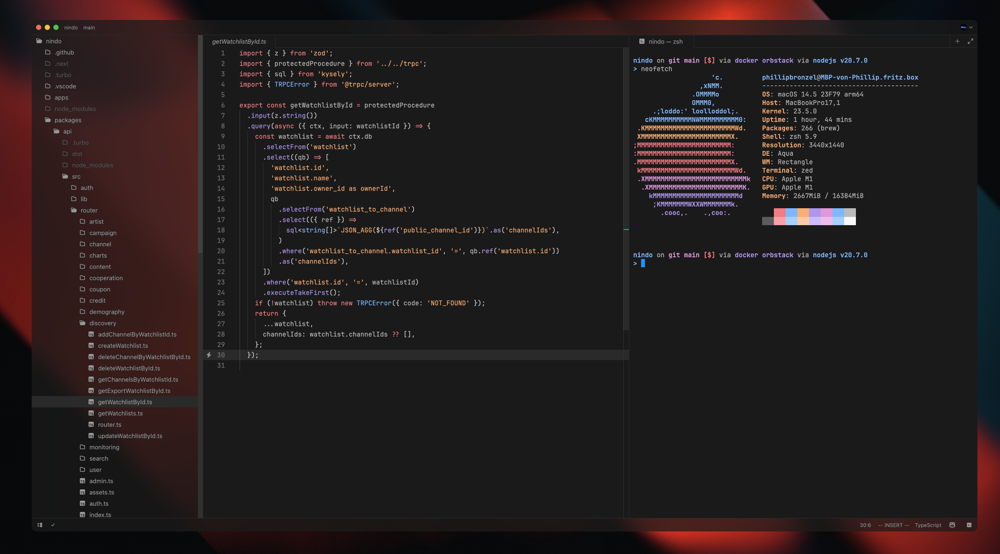
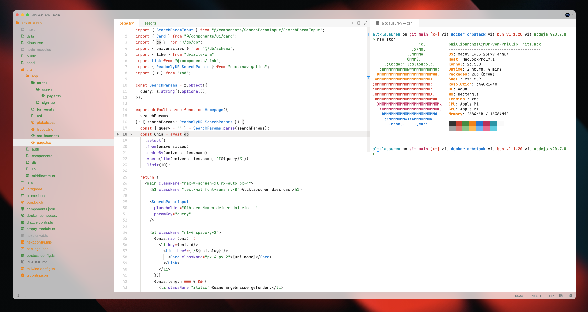

# Min Theme   

This theme aims to provide a clean and distraction-free coding environment while
maintaining excellent readability and visual appeal.

## Screenshots

### Dark Theme

### Light Theme

## Build

To build the theme, run `bun merge.js` in the root directory.

## Credits

This color theme is heavily inspired by [Miguel Solorio's Min Theme for VSCode](https://github.com/miguelsolorio/min-theme).

The Icons are taken from [Artem Laman's Chalice Icons](https://github.com/artlaman/chalice-icon-theme)

## License

This project is licensed under the MIT License - see the [LICENSE](LICENSE) file
for details.

## Support

If you like this theme, please consider giving it a star ⭐ on GitHub. It helps
others discover the project and motivates further development.

For any issues, questions, or suggestions, please
[open an issue](https://github.com/phibr0/zed-min-theme/issues) on GitHub.
